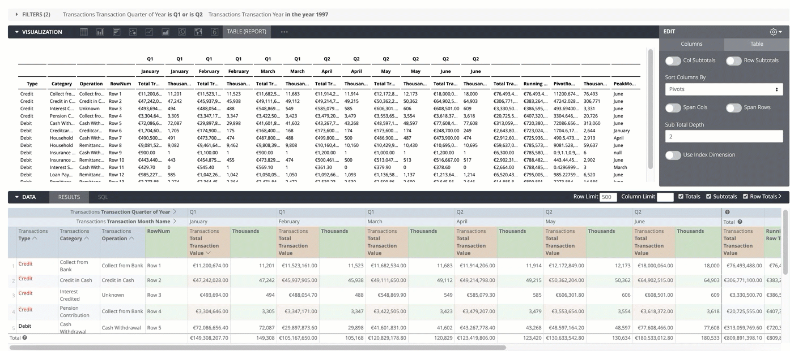

# Report Table



NOTE: Work in progress - some bugs will be found. First version ETA April 2020.

Intended to become a flexible table for producing printed reports. Goals / constraints include:

- Print nicely
- Single page output only (i.e. only so many rows & columns)
- Make it easy to do variances etc
- Format like a financial report
- Flexibility on sub-totals and running totals (e.g. easy to add rows, set orders)
- Limited data volume (e.g. 100 rows, 100 columns) => performance optimisation not required
- Minimal interactivity

# How to add to your Looker instance

Custom visualizations are documented [here](https://docs.looker.com/admin-options/platform/visualizations)

### Dependencies 

```
https://cdnjs.cloudflare.com/ajax/libs/d3/5.15.0/d3.min.js
```